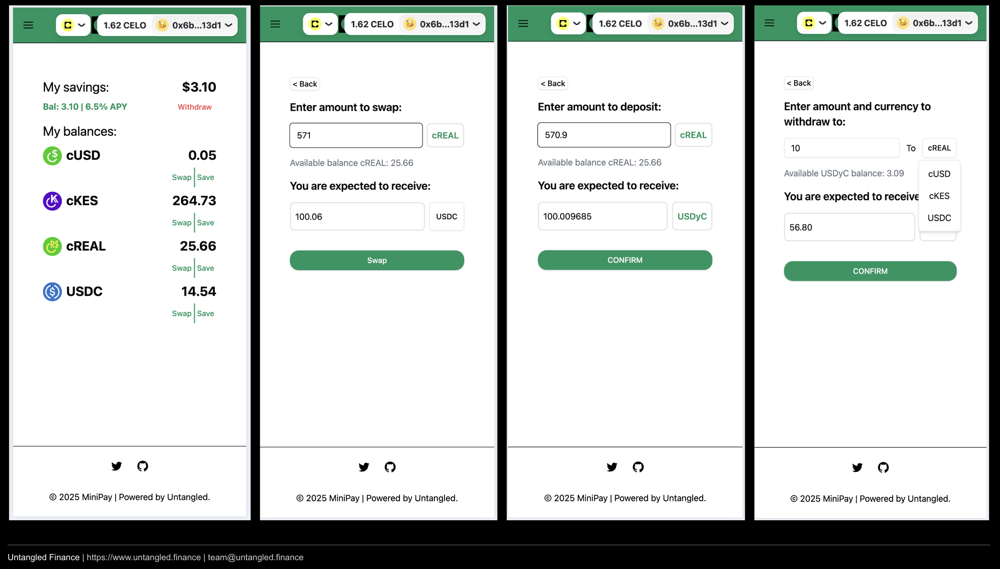
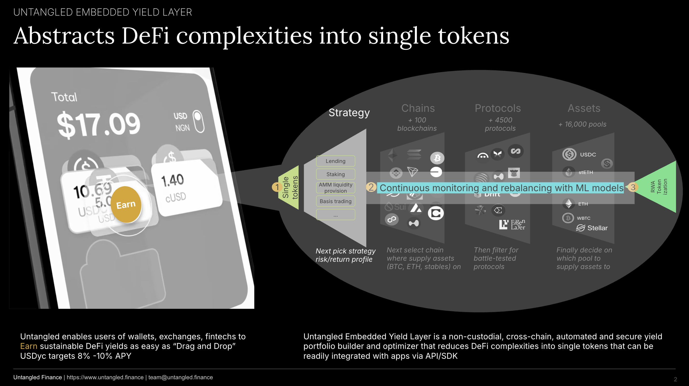

# Untangled MiniPay "Save" Button

Minipay/Global Stablecoin Hackathon: https://gap.karmahq.xyz/community/celo?programId=889_42161

This project is for 2 tracks: Multi-currency Borrow/Lending or Yield and Inflation Protection and Swapping 

As recommended by the MiniPay team, this solution focuses on yield opportunities on the Celo blockchain. 

## Minipay users need a "Save" button
Effortlessly swap local stables cKES, cZAR, cCOB, cREAL and deposit into a USD saving product currently yielding 8% -10% APY on Celo blockchain.

Video demo: https://flonnect.com/video/b44d519f1a4b-4cd7-89ad-48b9ac6989f1 

Deck: https://drive.google.com/open?id=1cc6zu0yBCxzAiY1KaOiVz8SfECIqsFVi&usp=drive_fs 

App: https://minipay-hackathon.vercel.app/ 

Untangled Embedded Yield Layer enables the MiniPay “Save” button. A greater depth into how it works here: https://mirror.xyz/untangledcredio.eth/qOgwJCsGIj8Vee6JBkig8_S5vxToIW7qLvBXzh8TGRs

